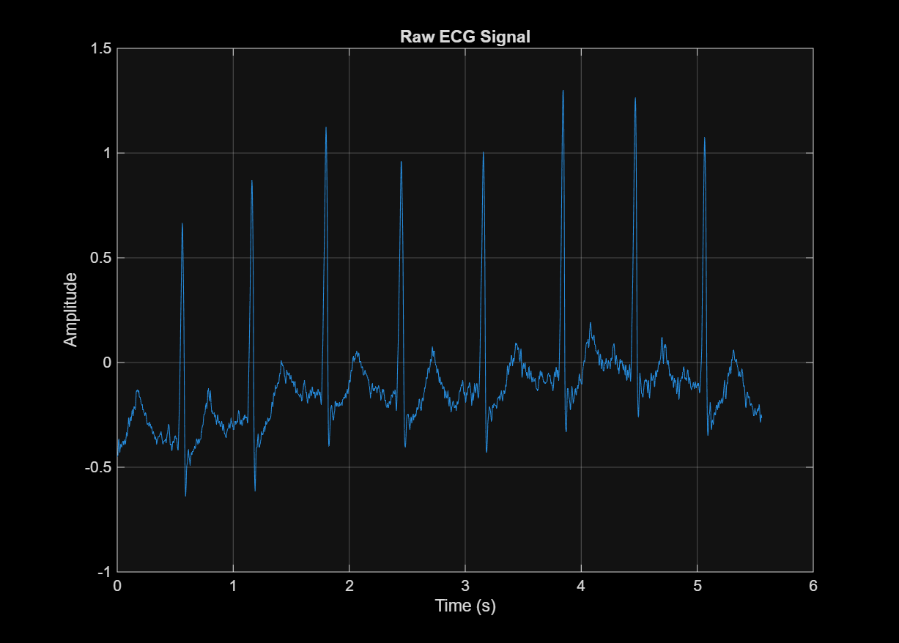
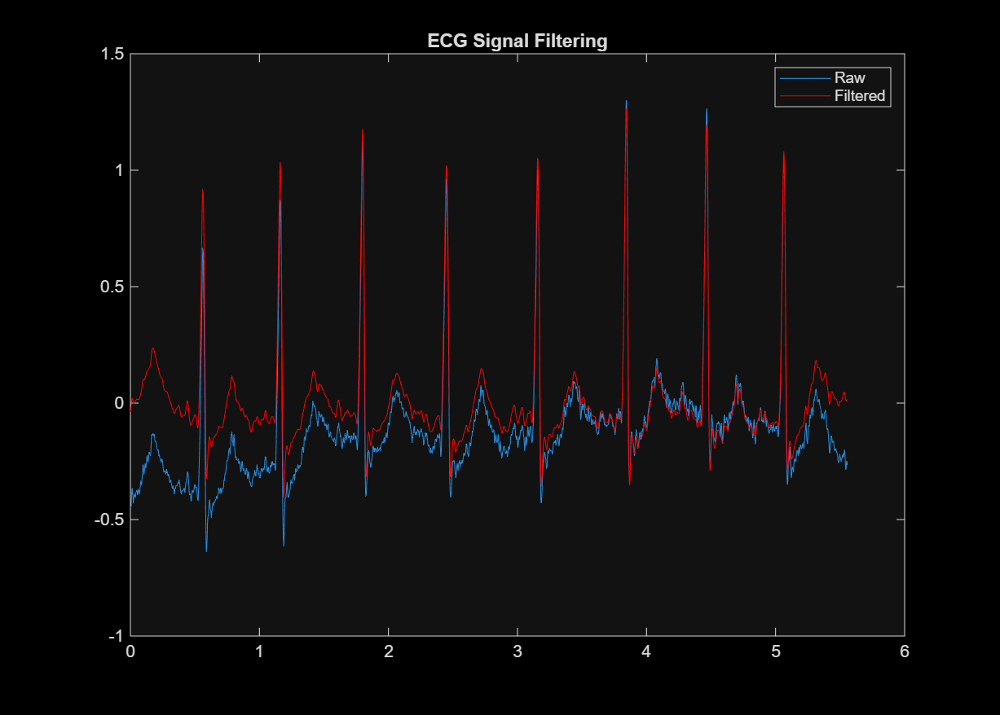
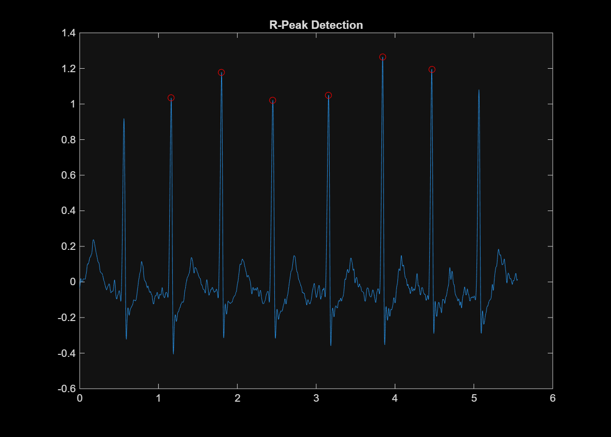

📊 Results - ECG Signal Processing
🔹 Raw ECG Signal

🔍 Analysis

* The raw ECG signal contains baseline drift, visible as a slow variation in the signal level.
* High-frequency noise is also present due to sensor interference and external disturbances.
* The QRS complexes are visible but not clearly distinguishable, making direct analysis difficult.

🔹 Filtered ECG Signal

🔍 Analysis

* A high-pass filter (0.5 Hz) successfully removes baseline wandering.
* A low-pass Butterworth filter (40 Hz) eliminates high-frequency noise.
* The signal is now centered around zero, improving interpretability.
* The morphology of ECG components (P, QRS, T) is preserved without distortion.

🔹 R-Peak Detection

🔍 Analysis

* R-peaks are accurately detected using a threshold-based peak detection algorithm.
* The use of minimum peak height and distance constraints avoids false detections.
* Peaks are uniformly spaced, indicating a regular heart rhythm.
* Clean filtering ensures high detection accuracy.

📈 Observations

* Baseline drift is effectively removed using high-pass filtering
* High-frequency noise is reduced using low-pass filtering
* Signal-to-noise ratio (SNR) is significantly improved
* R-peaks are clearly identifiable after preprocessing
* The filtered signal is suitable for reliable feature extraction

🎯 Conclusion

The implemented signal processing pipeline effectively enhances the ECG signal by removing noise and baseline drift. The use of Butterworth filtering preserves signal integrity while improving clarity.

Accurate R-peak detection enables reliable heart rate estimation, demonstrating the effectiveness of the approach for biomedical signal analysis.

🚀 Future Improvements

* Implement **Pan-Tompkins algorithm** for robust peak detection
* Use **Wavelet Transform** for advanced noise removal
* Extend to real-time ECG monitoring systems
